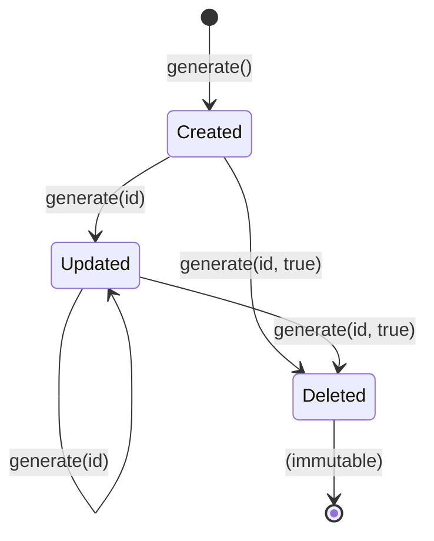

<div align="center">

<h1>TTID</h1>

<p><strong>Time-Tagged Identifiers</strong> — compact IDs that carry their own <em>created</em>, <em>updated</em>, and <em>deleted</em> timestamps.</p>

<p>
  <a href="https://github.com/d31ma/TTID/releases/latest"></a>
  <a href="https://github.com/d31ma/TTID/actions/workflows/ci.yml"></a>
  <a href="https://opensource.org/licenses/MIT"></a>
  
  <a href="https://github.com/d31ma/TTID/stargazers"></a>
</p>

<p>
  <code>curl -fsSL https://github.com/d31ma/TTID/releases/latest/download/install.sh | sh</code>
</p>

<p>
  <a href="#installation">Install</a> &nbsp;·&nbsp;
  <a href="#language-clients">Clients</a> &nbsp;·&nbsp;
  <a href="#cli-and-binary-usage">CLI</a> &nbsp;·&nbsp;
  <a href="#api-reference">API</a> &nbsp;·&nbsp;
  <a href="#comparison-with-other-systems">vs UUID / ULID</a>
</p>

</div>

---

<table>
<tr>
<td width="33%" valign="top">

### ⏱ Time-tagged

`created`, `updated`, and `deleted` timestamps are encoded right in the ID — no extra columns, no lookup.

</td>
<td width="33%" valign="top">

### 🔒 Immutable end state

Once deleted (three segments) an ID can never be modified again. The lifecycle is enforced, not conventional.

</td>
<td width="33%" valign="top">

### 🪶 Compact & sortable

Base-36, 11-character segments. Lexicographically sortable by creation time and URL-safe.

</td>
</tr>
<tr>
<td width="33%" valign="top">

### 🌍 Any language

Dependency-free client shims for **8 languages** drive a single `ttid` binary.

</td>
<td width="33%" valign="top">

### 📦 No package manager

Ship one binary from GitHub Releases. No npm, no native addons, no build step.

</td>
<td width="33%" valign="top">

### 🧩 Machine-friendly

Every command emits structured JSON, so any runtime can call TTID over stdio.

</td>
</tr>
</table>

---

## Table of Contents

- [Overview](#overview)
- [Installation](#installation)
- [CLI and Binary Usage](#cli-and-binary-usage)
- [Language Clients](#language-clients)
- [API Reference](#api-reference)
- [Format Specification](#format-specification)
- [Lifecycle States](#lifecycle-states)
- [Comparison with Other Systems](#comparison-with-other-systems)
- [Use Cases](#use-cases)
- [Performance Considerations](#performance-considerations)
- [Security](#security)
- [License](#license)

---

## Overview

TTID creates unique identifiers with a progressive structure — the ID grows one segment at a time as the record moves through its lifecycle:

- **Created:** `[CREATION_TIMESTAMP]`
- **Updated:** `[CREATION_TIMESTAMP]-[UPDATE_TIMESTAMP]`
- **Deleted:** `[CREATION_TIMESTAMP]-[UPDATE_TIMESTAMP]-[DELETION_TIMESTAMP]`



Each TTID segment contains:

- High-resolution timestamps encoded in base-36
- Progressive expansion to track lifecycle states
- Compact 11-character timestamps for efficiency
- Immutable deletion state (cannot be modified once deleted)

---

## Installation

TTID ships as a single self-contained `ttid` binary, published to
[GitHub Releases](https://github.com/d31ma/TTID/releases). Any language uses it
through a thin [client shim](clients/) — no npm, no native addon.

### Install the binary

```sh
# macOS / Linux
curl -fsSL https://github.com/d31ma/TTID/releases/latest/download/install.sh | sh
```

```powershell
# Windows (PowerShell)
irm https://github.com/d31ma/TTID/releases/latest/download/install.ps1 | iex
```

The installer downloads the right binary for your OS/arch from the latest
release, verifies its checksum, and puts `ttid` on your PATH. Then verify:
`ttid --help`.

Prefer to do it by hand? Download the asset for your platform from the
[latest release](https://github.com/d31ma/TTID/releases/latest) —
`ttid-linux-x64`, `ttid-linux-arm64`, `ttid-macos-x64`, `ttid-macos-arm64`, or
`ttid-windows-x64.exe` — `chmod +x` it, and move it onto your PATH. Checksums
are in `SHA256SUMS`.

### Use it from your language

Drop the one-file client for your language into your project and call TTID like
a library — it drives the `ttid` binary for you. See [clients/](clients/) for
Python, Ruby, Node/TS, PHP, Go, Rust, C#, and Java.

---

## CLI and Binary Usage

TTID exposes a `ttid` command. Every command writes structured JSON to stdout and exits non-zero on input or lifecycle errors, which makes it practical for Python, Go, Ruby, PHP, Java, shell scripts, and other runtimes to call.

```sh
ttid generate
ttid generate 0HDE5K8S8J9
ttid generate 0HDE5K8S8J9 --delete
ttid decode 0HDE5K8S8J9
ttid validate 0HDE5K8S8J9
```

For language interop, use the machine interface:

```sh
ttid exec --request '{"requestId":"new-user","op":"generate"}'
ttid exec --request '{"requestId":"delete-user","op":"generate","id":"0HDE5K8S8J9","delete":true}'
```

Successful responses look like this:

```json
{
  "protocolVersion": 1,
  "ok": true,
  "op": "generate",
  "requestId": "new-user",
  "durationMs": 1,
  "result": "0HDE5K8S8J9"
}
```

Errors use the same envelope:

```json
{
  "protocolVersion": 1,
  "ok": false,
  "op": "generate",
  "requestId": "delete-user",
  "durationMs": 1,
  "error": {
    "name": "Error",
    "message": "Invalid TTID!"
  }
}
```

Build a standalone executable:

```sh
bun run build:exe
./dist-bin/ttid generate
./dist-bin/ttid exec --request '{"op":"generate"}'
```

---

## Language Clients

Any language uses TTID through a thin, dependency-free [client shim](clients/)
that drives the `ttid` binary over a persistent stdin/stdout loop. Drop the one
file for your language into your project and call TTID like a library. Method
names follow each language's own convention — `snake_case`, `camelCase`, or
`PascalCase`. Full details in [clients/README.md](clients/README.md).

| Language | Client file | Convention |
| --- | --- | --- |
| Python | [`clients/python/ttid.py`](clients/python/ttid.py) | `snake_case` |
| Ruby | [`clients/ruby/ttid.rb`](clients/ruby/ttid.rb) | `snake_case` |
| Node / TypeScript | [`clients/node/ttid.mjs`](clients/node/ttid.mjs) | `camelCase` |
| PHP | [`clients/php/ttid.php`](clients/php/ttid.php) | `camelCase` |
| Go | [`clients/go/ttid.go`](clients/go/ttid.go) | `PascalCase` |
| Rust | [`clients/rust/ttid.rs`](clients/rust/ttid.rs) | `snake_case` |
| C# | [`clients/csharp/Ttid.cs`](clients/csharp/Ttid.cs) | `PascalCase` |
| Java | [`clients/java/Ttid.java`](clients/java/Ttid.java) | `camelCase` |

<details open>
<summary><strong>Python</strong></summary>

```python
from ttid import TTID

with TTID() as t:
    id = t.generate()              # new id
    updated = t.generate(id)       # advance it
    deleted = t.generate(updated, delete=True)
    print(t.decode_time(deleted))  # {"createdAt": ..., "updatedAt": ..., "deletedAt": ...}
    print(t.is_ttid(id))           # {"valid": True, "createdAt": ...}
    print(t.is_uuid("not-a-uuid")) # {"valid": False}
```

</details>

<details>
<summary><strong>Node / TypeScript</strong></summary>

```js
import { TTID } from './ttid.mjs'

const t = new TTID()
const id = await t.generate()             // new id
const updated = await t.generate(id)      // advance it
await t.generate(updated, true)           // mark deleted
console.log(await t.decodeTime(updated))  // { createdAt, updatedAt }
console.log(await t.isTTID(id))           // { valid, createdAt }
await t.close()
```

</details>

<details>
<summary><strong>Ruby</strong></summary>

```ruby
require_relative 'ttid'

TTID.open do |t|
  id = t.generate                       # new id
  updated = t.generate(id)              # advance it
  t.generate(updated, delete: true)     # mark deleted
  p t.decode_time(updated)              # {"createdAt"=>..., "updatedAt"=>...}
  p t.is_ttid(id)                       # {"valid"=>true, "createdAt"=>...}
end
```

</details>

<details>
<summary><strong>PHP</strong></summary>

```php
require 'ttid.php';

$t = new TTID();
$id = $t->generate();                 // new id
$updated = $t->generate($id);         // advance it
$t->generate($updated, true);         // mark deleted
print_r($t->decodeTime($updated));    // ["createdAt" => ..., "updatedAt" => ...]
print_r($t->isTTID($id));             // ["valid" => true, "createdAt" => ...]
$t->close();
```

</details>

<details>
<summary><strong>Go</strong></summary>

```go
import "yourmodule/ttid" // copy ttid.go into a package dir

t, _ := ttid.Open("ttid")
defer t.Close()

id, _ := t.Generate("", false)         // new id
updated, _ := t.Generate(id.(string), false)
t.Generate(updated.(string), true)     // mark deleted
times, _ := t.DecodeTime(updated.(string))
valid, _ := t.IsTTID(id.(string))
fmt.Println(times, valid)
```

</details>

<details>
<summary><strong>Rust</strong></summary>

```rust
mod ttid;
use ttid::Ttid;

let mut t = Ttid::open("ttid")?;
let id = t.generate(None, false)?;      // response line: {..."result":"4VL..."}
let up = t.generate(Some("4VL..."), false)?;
t.generate(Some("4VL..."), true)?;      // mark deleted
let times = t.decode_time("4VL...")?;   // methods return the raw JSON response
let valid = t.is_ttid("4VL...")?;       // line — parse with serde if you want structs
t.close()?;
```

</details>

<details>
<summary><strong>C#</strong></summary>

```csharp
using var t = new Ttid.Ttid();
string id = t.Generate().GetString();       // new id
t.Generate(id);                             // advance it
t.Generate(id, del: true);                  // mark deleted
JsonElement times = t.DecodeTime(id);       // { createdAt, updatedAt? }
JsonElement valid = t.IsTTID(id);           // { valid, createdAt }
JsonElement uuid  = t.IsUUID("not-a-uuid"); // { valid }
```

</details>

<details>
<summary><strong>Java</strong></summary>

```java
try (Ttid t = new Ttid()) {
    String id = t.generate();        // response line: {..."result":"4VL..."}
    t.generate("4VL...");            // advance it
    t.generate("4VL...", true);      // mark deleted
    String times = t.decodeTime("4VL..."); // methods return the raw JSON
    String valid = t.isTTID("4VL..."); // response line — parse with Jackson/Gson
}
```

</details>

---

## API Reference

### `TTID.generate(id?: string, del?: boolean)`

Generates a new TTID or updates an existing one.

**Parameters:**
- `id` (optional) - An existing TTID to update
- `del` (optional) - Set to `true` to mark the ID as deleted

**Returns:** `_ttid` - A TTID string

**Behavior:**
- No parameters: Creates new ID `[TIMESTAMP]`
- Valid TTID provided: Updates to `[CREATED]-[NEW_TIMESTAMP]`
- Valid TTID + `del=true`: Marks as deleted `[CREATED]-[UPDATED]-[DELETED_TIMESTAMP]`

**Throws:**
- Error if provided ID is invalid
- Error if attempting to modify a deleted ID (3 segments)

### `TTID.decodeTime(id: string)`

Decodes timestamps from a TTID.

**Parameters:**
- `id` - A TTID string

**Returns:** `_timestamps` object with:
- `createdAt` - Creation timestamp in milliseconds
- `updatedAt` (optional) - Update timestamp in milliseconds
- `deletedAt` (optional) - Deletion timestamp in milliseconds

**Throws:** Error if the format is invalid

### `TTID.isTTID(id: string)`

Validates a TTID and returns creation date if valid.

**Parameters:**
- `id` - A string to validate

**Returns:**
- `Date` object (creation date) if valid
- `null` if invalid

### `TTID.isUUID(id: string)`

Checks if a string is a valid UUID.

**Parameters:**
- `id` - A string to check

**Returns:** `RegExpMatchArray | null` - Match result or null

---

## Format Specification

TTIDs follow a strict format:
- Base-36 encoding (0-9, A-Z)
- 11-character timestamps
- Hyphen-separated segments
- Progressive structure

**Valid Patterns:**
- `[A-Z0-9]{11}` - Created only
- `[A-Z0-9]{11}-[A-Z0-9]{1,11}` - Created + Updated
- `[A-Z0-9]{11}-[A-Z0-9]{1,11}-[A-Z0-9]{1,11}` - Created + Updated + Deleted

**Special Cases:**
- Placeholder 'X' may appear in update position for certain states
- Deleted IDs cannot be modified further

---

## Lifecycle States

| State | Format | Segments | Modifiable |
|-------|--------|----------|------------|
| Created | `TIMESTAMP` | 1 | ✅ |
| Updated | `CREATED-UPDATED` | 2 | ✅ |
| Deleted | `CREATED-UPDATED-DELETED` | 3 | ❌ |

---

## Comparison with Other Systems

| Feature | TTID | UUID | ULID |
|---------|------|------|------|
| Progressive states | ✅ | ❌ | ❌ |
| Soft delete tracking | ✅ | ❌ | ❌ |
| Immutable final state | ✅ | ❌ | ❌ |
| Compact encoding | ✅ | ❌ | ✅ |
| Time-based | ✅ | ⚠️ | ✅ |
| Fixed length | ❌ | ✅ | ✅ |

---

## Use Cases

- **Database Records**: Track entity lifecycle (created → updated → soft deleted)
- **Audit Systems**: Maintain chronological history in the ID itself
- **Document Management**: Version control with embedded timestamps
- **API Resources**: RESTful endpoints with state-aware identifiers
- **Event Sourcing**: Compact event identifiers with temporal information

---

## Performance Considerations

- Base-36 encoding provides compact representation
- Progressive format minimizes storage for simple states
- High-resolution timestamps ensure uniqueness in high-frequency scenarios
- Validation includes timestamp parsing for integrity checking

---

## Security

`_ttid` is a TypeScript template-literal type, not a runtime-enforced brand. TypeScript alone cannot prevent a plain `string` from being used where a `_ttid` is expected.

**Rule:** always obtain TTID values via `TTID.generate()` or validate them with `TTID.isTTID()` before using them in any security-sensitive context (database keys, access-control checks, audit logs).

```typescript
const raw: string = externalInput()
const valid = TTID.isTTID(raw)   // returns Date | null
if (!valid) throw new Error('Invalid identifier')
// safe to use raw as _ttid from here
```

Input length is bounded to 36 characters before any regex evaluation, preventing CPU exhaustion from pathological inputs.

---

## License

Released under the [MIT License](https://opensource.org/licenses/MIT).

<div align="center">
<sub>Built with <a href="https://bun.sh">Bun</a> · Distributed as a single binary via <a href="https://github.com/d31ma/TTID/releases">GitHub Releases</a></sub>
</div>
